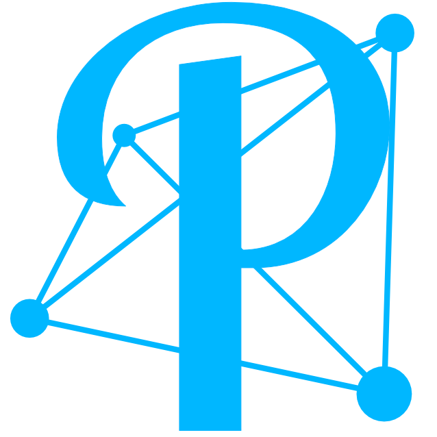
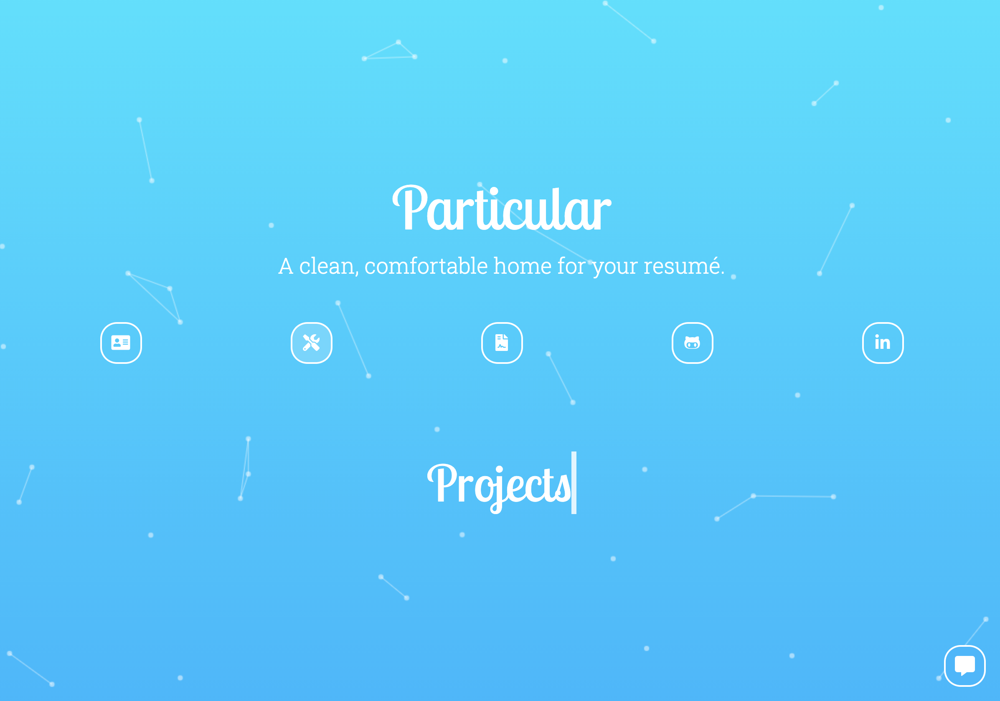
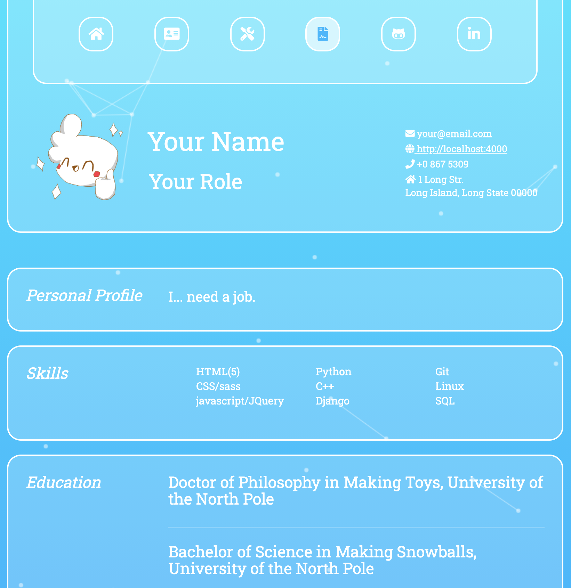

</image>

</image>

</image>

# About
Particular is a jekyll theme for personal websites.

[Live Demo](https://www.michael-ashton.com)

It's best suited for hosting an interactive-resume site, but can easily be tweaked for
lots of other purposes.

The theme is loosely built on pieces from [freelancer](https://github.com/jeromelachaud/freelancer-theme),
and imports the very cool [particleground.js](https://github.com/jnicol/particleground) tool for its backgrounds.

If you have any questions or have a bug to report, please so so via the [issues page](https://github.com/ashtonmv/particular_theme/issues).

# Installation and setup
You will need ruby and bundler installed, just like for any other jekyll site.
Ruby is probably already on your machine; instructions for installing bundler can be found [here](https://bundler.io/).

```
git clone https://github.com/ashtonmv/particular_theme.git
cd particular_theme
bundle install
bundle exec jekyll serve
```

If you've installed everything correctly, this will start the local server. Visit `localhost` to view the site.

# Configuration
My design principle for this theme was to make nearly everything editable via `.yml` files, because I find them
super intuitive.

## Basic Settings
The most fundamental settings for the theme are configured via `_config.yml`:

```yaml
title: Particular
email: your@email.com
baseurl: ""
description: A clean, comfortable home for your resumé.
keywords: Web, Development, Software, Programmer, Coding, Resume, resume
meta_author: Your Name

# Build settings
markdown: kramdown
permalink: pretty
```

## Other settings
Most other settings are configured via files under `_data`:
  
  - `about.yml`: configure image and text on the "About Me" page
  - `formbutton.yml`: create and configure a formspree formbutton for your site
  - `nav-icons.yml`: main navigation icons on all pages. Change these to showcase the internal/external pages you want.
  - `particles.yml`: styling options for the particleground backgrounds
  - `resume.yml`: data to fill in your "Resume" page

### Styling
The best way to change the basic style of the theme is via `_sass/head.scss`, which contains the main
Sass variables used in the theme's stylesheet (`_sass/style.scss`).

In addition to controlling the theme colors, `_sass/head.scss` is where custom fonts should be imported
and where responsive CSS breakpionts can be controlled. The current breakpoints work well for most mobile
devices and probably don't need to be changed (I hope).

Technically the theme also uses bootstrap, which is included via `style/bootstrap.min.css`.

## HTML files
Even though it was my goal to shelter you from them, you will occasionally need to directly edit the
HTML files under `_includes`. For example, if you want to include different fields in your resumé, or
add some new JavaScript, you'll need to understand the HTML file layout.

Every page on the theme inherits its layout from `_layouts/default.html`, and only the content of the
page depends on the specific url. Below are all of the HTML files that live in `_includes`, and a
description of the urls for which they are included in `_layouts/default.html`.

- `404.html`: included when url == /404 (or anything not found)
- `about.html`: included when url == /about
- `formbutton.html`: included everywhere (if `_data/formbutton.yml` has been appropriately configured)
- `head.html`: included everywhere for metadata, stylesheets and JS imports
- `home.html`: included when url == /
- `js.html`: included everywhere (via `head.html`)
- `nav.html`: included everywhere; just looks different when url == / or /404
- `particles.html`: included everywhere to create particleground backgrounds
- `projects.html`: included when url == /projects
- `resume.html`: included when url == /resume
- `typewrite.html`: included when url == /home or /404 for "typewriting" the text when nav-icon:hover

# Adding your own content
## Projects
You can manage your projects under `projects/_posts`. I've included 6 dummy projects in there that you
can change or replace with your own projects. Unfortunately, the file naming convention for jekyll-based posts
is quite strict (YYYY-MM-DD-title.md). Posts with different naming conventions will probably not show in this or
any other theme.

## Images
All images can be added to and imported from the `img/` folder in the theme root. The only exception is
`favicon.ico`, which lives in the theme root.

## Resumé
You'll need to upload your resumé as a PDF file (under `downloads/`) so that visitors can download it
using the button at the bottom of the /resume page.

I wish there was a good way to automatically render the HTML resume from this theme as a PDF, but
so far I haven't found any.
